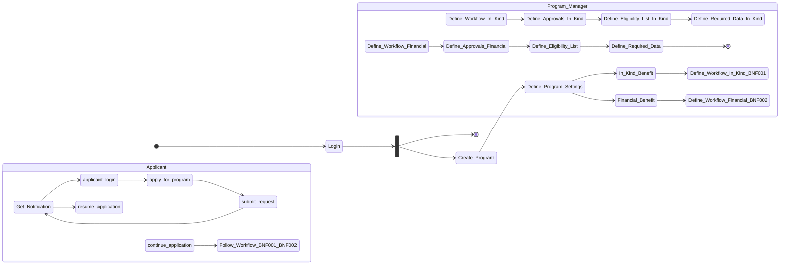

#Introduction
This repo is part of my experimentation with React, Redux with Graphql and Spring boot.

#Tech Stack
RabbitMQ, React, Redux, Spring Boot, Graphql

```mermaid
stateDiagram
    direction LR
    [*] --> Login
    state is_valid_login <<fork>>
        is_valid_login --> [*]
        Login --> is_valid_login
            is_valid_login --> Create_Program
            Create_Program --> Define_Program_Settings
            state Program_Manager {
            direction LR
            Define_Program_Settings --> In_Kind_Benefit
            In_Kind_Benefit --> Define_Workflow_In_Kind_BNF001
            Define_Workflow_In_Kind --> Define_Approvals_In_Kind
            Define_Approvals_In_Kind --> Define_Eligibility_List_In_Kind
            Define_Eligibility_List_In_Kind --> Define_Required_Data_In_Kind
            Define_Program_Settings --> Financial_Benefit
            Financial_Benefit --> Define_Workflow_Financial_BNF002
            Define_Workflow_Financial --> Define_Approvals_Financial
            Define_Approvals_Financial --> Define_Eligibility_List
            Define_Eligibility_List --> Define_Required_Data
            Define_Required_Data --> [*]
    }
    State Applicant {
        direction LR
        Get_Notification --> applicant_login
        applicant_login --> apply_for_program
        apply_for_program --> submit_request
        submit_request --> Get_Notification
        Get_Notification --> resume_application
        continue_application --> Follow_Workflow_BNF001_BNF002
    }
```